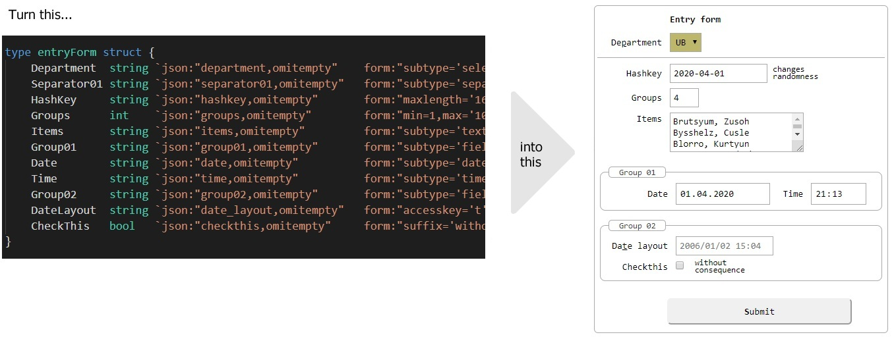
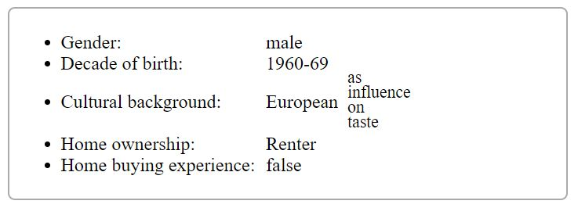

# struc2frm



## Golang Struct to HTML Form

[](https://godoc.org/github.com/pbberlin/struc2frm) 
[](https://travis-ci.org/pbberlin/struc2frm) 
[](https://codecov.io/gh/pbberlin/struc2frm) 

* Package struc2frm converts a golang `struct type` into an `HTML input form`.

* All your backend forms generated directly from golang structs.

* HTML input field info is taken from the `form` struct tag.

* Decode() and DecodeMultipartForm() transform the HTTP request data 
back into an instance of the `struct type` used for the HTML code.

* Decode() and DecodeMultipartForm() also check the   
auto-generated form token against [CSRF attacks](https://en.wikipedia.org/wiki/Cross-site_request_forgery).  

* Use `Form()` to render an HTML form  

* Use `Card()` to render a read-only HTML card.



* Fully functional example-webserver in directory `systemtest`;  
compile and run, then  
[Main example](http://localhost:8085/)  
[File upload example](http://localhost:8085/file-upload)

## Example use

```golang
type entryForm struct {
    Department  string   `json:"department,omitempty"    form:"subtype='select',accesskey='p',onchange='true',label='Department/Abteilung',title='loading items'"`
    Separator01 string   `json:"separator01,omitempty"   form:"subtype='separator'"`
    HashKey     string   `json:"hashkey,omitempty"       form:"maxlength='16',size='16',autocapitalize='off',suffix='salt&comma; changes randomness'"` // the &comma; instead of , prevents wrong parsing
    Groups      int      `json:"groups,omitempty"        form:"min=1,max='100',maxlength='3',size='3'"`
    Items       string   `json:"items,omitempty"         form:"subtype='textarea',cols='22',rows='4',maxlength='4000',label='Textarea of<br>line items',title='add times - delimited by newline (enter)'"`
    Items2      []string `json:"items2,omitempty"        form:"subtype='select',size='3',multiple='true',label='Multi<br>select<br>dropdown',autofocus='true'"`
    Group01     string   `json:"group01,omitempty"       form:"subtype='fieldset'"`
    Date        string   `json:"date,omitempty"          form:"subtype='date',nobreak=true,min='1989-10-29',max='2030-10-29'"`
    Time        string   `json:"time,omitempty"          form:"subtype='time',maxlength='12',inputmode='numeric',size='12'"`
    Group02     string   `json:"group02,omitempty"       form:"subtype='fieldset'"`
    DateLayout  string   `json:"date_layout,omitempty"   form:"accesskey='t',maxlength='16',size='16',pattern='[0-9\\.\\-/]{2&comma;10}',placeholder='2006/01/02 15:04',label='Layout of the date'"` // 2006-01-02 15:04
    CheckThis   bool     `json:"check_this,omitempty"    form:"suffix='without consequence'"`

    // Requires distinct way of form parsing
    // Upload     []byte `json:"upload,omitempty"       form:"accesskey='u',accept='.xlsx'"`
}

// Validate checks whether form entries as a whole are "submittable";
// more than just 'populated'
// Validate generates error messages
func (frm entryForm) Validate() (map[string]string, bool) {
    errs := map[string]string{}
    g1 := frm.Department != ""
    g2 := frm.CheckThis
    if !frm.CheckThis {
        errs["check_this"] = "You need to comply"
    }
    g3 := frm.Items != ""
    return errs, g1 && g2 && g3
}


// getting a converter
s2f := struc2frm.New()  // or clone existing one
s2f.ShowHeadline = true // set options
s2f.SetOptions("department", []string{"ub", "fm"}, []string{"UB", "FM"})

// init values - non-multiple
frm := entryForm{
    HashKey: time.Now().Format("2006-01-02"),
    Groups:  2,
    Date:    time.Now().Format("2006-01-02"),
    Time:    time.Now().Format("15:04"),
}

// pulling in values from http request
populated, err := Decode(req, &frm)
if populated && err != nil {
    s2f.AddError("global", fmt.Sprintf("cannot decode form: %v<br>\n <pre>%v</pre>", err, indentedDump(r.Form)))
    log.Printf("cannot decode form: %v<br>\n <pre>%v</pre>", err, indentedDump(r.Form))
}

// init values - multiple
if !populated {
    if len(frm.Items2) == 0 {
        frm.Items2 = []string{"berta", "dora"}
    }
}

errs, valid := frm.Validate()

if populated {
    if !valid {
        s2f.AddErrors(errs) // add errors only for a populated form
    } else {
        // further processing with valid form data
    }
}

if !valid {
    // render to HTML for user input / error correction
    fmt.Fprint(w, s2f.Form(frm))
}


```

## Global options

* `ShowHeadline` - show a headline derived from struct name; default `false`.

* `FormTag` - suppress the surrounding `<form ...> ... </form>` if you want to compose a form from multiple structs.

* `Name` - form name attribute; default `frmMain`

* `Method` - GET or POST; default `POST`

* `Salt` and `FormTimeout` - parameters to generate CSRF token

* `FocusFirstError` - focus on inputs with errors; default `true`

* `ForceSubmit` - show submit button despite `onchange=form.submit()`; default `false`

* `Indent`, `IndentAddenum`, `VerticalSpacer` - change indentation in `px`; vertical spacing in `rem`

* `CSS` - default CSS classes for reasonable appearance.  
Incorporate similar rules into your application style sheet,  
and set to empty string.

## Attributes for field types

* Use `float64` or `int` to create number inputs - with attributes `min=1,max=100,step=2`.  
Notice that `step=2` defines maximum precision; uneven numbers become invalid.  
This is an [HTML5 restriction](https://stackoverflow.com/questions/14365348/).

* `string` supports attribute `placeholder='2006/01/02 15:04'` to show a pattern to the user (placeholder).

* `string` supports attribute `pattern='[0-9\\.\\-/]{10}'` to restrict the entry to a regular expression.

* Use attributes `maxlength='16'` and `size='16'`  
determine width and maximum content length respectively for `input` and `textarea`.  
Attribute `size` determines height for select/dropdown elements.

* Use `string` field with subtype `textarea` and attributes `cols='32',rows='22'`

* Use `string` field with subtype `date` and attributes  `min='1989-10-29'` or `max=...`

* Use `string` field with subtype `time`

* Use `bool` to create a checkbox

### Separator and fieldset

These are `dummmy` fields for formatting only

* Every `string` field with subtype `separator` is rendered into a horizontal line
  * If the struct tag `form` has as `label`, then its contents are rendered.  
  Serving as static text paragraph.

* Every `string` field with subtype `fieldset` is rendered into grouping box with label

### Select / dropdown inputs

* Use `string | int | float64 | bool` field with subtype `select`

* Use `size=1` or `size=5` to determine the height

* Use `SetOptions()` to fill input[select] elements

* Use `DefaultOptionKey()` to read the pre-selected option on clean forms

* Use `onchange='true'` for onchange submit

#### Select multiple

* Use `multiple='true'` to enable the selection of __multiple items__  
  in conjunction with struct field type `[]string | []int | []float64 | []bool`

* Use `wildcardselect='true'` to show an additional input after the select,  
accepting wildcard expressions with `*` for selecting options from the select.  
  * Wildcard expressions are case sensitive.  
  * Multiple wildcard expressions can be chained using `;`.  
  * Multiple expressions are applied successively additively.  
  * Any wildcard expression can be negated by `!` prefixing, resulting in _unselect_.  
  * Example `Car*;Bike*;!Carsharing`.  
  * To debug, open the Javascript console of your browser and type `wildcardselectDebug = true;`

* Parsing of HTTP request into form struct for `multiple` fields  
is __additive__.

* => Init values should not be set before parsing but afterwards.  

```golang
// ...
populated, err := Decode(req, &frm)
// ...

if len(frm.Items2) == 0 {
    frm.Items2 = []string{"berta", "dora"} // setting defaults if request parsing did not yield any user input
}
```

## Submit button

If your form only has `select` inputs with `onchange='this.form.submit()'`  
then no submit button is shown.

This can be overridden by setting `struc2frm.New().ShowSubmit` to true.

## General field attributes

* Use `form:"-"` to exclude fields from being rendered  
neither in form view nor in card view

* Every field can have an attribute `label=...`,  
appearing before the input element,  
if not specified, json:"[name]..." is labelized and used
  * `labelwidth` can specify an individual label width in CSS units such as `5px` or `1rem`

* Every field can have an attribute `suffix=...`,  
appearing after the input element

* Every field can have an attribute `title=...`  
for mouse-over tooltips

* Values inside of `label='...'`, `suffix='...'`, `title='...'`, `placeholder='...'`, `pattern='...'`  
need `&comma;` instead  of `,`

* Every field  can have an attribute `accesskey='t'`  
Accesskeys are not put into the label, but into the input tag

* Every field  can have an attribute `nobreak='true'`  
so that the next input remains on the same line

* Every field  can have an attribute `autofocus='true'`  
setting the keyboard focus to this input.  
Use this only once per form.  
`autofocus='true'` is overwritten by `FocusFirstError==true`; see below.

### Field attributes for mobile phones

* `inputmode="numeric"` opens the numbers keyboard on mobile phones

* `autocapitalize=off` switches off first letter upper casing

## Validation and errors

The `Validator` interface is non mandatory helper interface for form structs.

```golang
type Validator interface {
    Validate() (map[string]string, bool)
}
```

It returns error messages suitable for `s2f.AddErrors()`.

```golang
if populated {
    errs, valid := frm.Validate()
    if !valid {
        s2f.AddErrors(errs) // add errors only for a populated form
        // render to HTML for user input / error correction
        fmt.Fprint(w, s2f.Form(frm))
```

A _valid_ form struct enables further processing.

```golang
    } else {
        // further processing
    }
```

* Keep `FocusFirstError=true` to focus the first input having an error message.

* This overrides `autofocus='true'`.

## File upload

* input[file] must have golang type `[]byte`

* input[file] should be named `upload`  
and _requires_ `ParseMultipartForm()` instead of `ParseForm()`

* `DecodeMultipartForm()` and `ExtractUploadedFile()` are helper funcs  
to extract file upload data

Example

```golang

type entryForm struct {
    TextField string `json:"text_field,omitempty"   form:"maxlength='16',size='16'"`
    // Requires distinct way of form parsing
    Upload []byte `json:"upload,omitempty"          form:"accesskey='u',accept='.txt',suffix='*.txt files'"`
}

s2f := struc2frm.New()  // or clone existing one
s2f.ShowHeadline = true // set options
s2f.Indent = 80


// init values
frm := entryForm{
    TextField: "some-init-text",
}

populated, err := DecodeMultipartForm(req, &frm)
if populated && err != nil {
    s2f.AddError("global", fmt.Sprintf("cannot decode multipart form: %v<br>\n <pre>%v</pre>", err, indentedDump(req.Form)))
    log.Printf("cannot decode multipart form: %v<br>\n <pre>%v</pre>", err, indentedDump(req.Form))
}

bts, excelFileName, err := ExtractUploadedFile(req)
if err != nil {
    fmt.Fprintf(w, "Cannot extract file from POST form: %v<br>\n", err)
}

fileMsg := ""
if populated {
    fileMsg = fmt.Sprintf("%v bytes read from excel file -%v- <br>\n", len(bts), excelFileName)
    fileMsg = fmt.Sprintf("%vFile content is --%v-- <br>\n", fileMsg, string(bts))
} else {
    fileMsg = "No upload filename - or empty file<br>\n"

}

fmt.Fprintf(
    w,
    defaultHTML,
    s2f.HTML(frm),
    fileMsg,
)
```

See `handler-file-upload_test.go` on how to programmatically POST a file and key-values.

## CSS Styling

* Styling is done via CSS selectors  
and can be customized  
by changing or appending `struc2frm.New().CSS`

* If you already have good styles in your website,  
set `CSS = ""`

```CSS
div.struc2frm {
    padding: 4px;
}
div.struc2frm  input {
    margin:  4px;
}
```

The media query CSS block in default `struc2frm.New().CSS`  
can be used to change the label width depending on screen width.

Label width can also be changed by setting  
via `struc2frm.New().Indent` and `struc2frm.New().IndentAddenum`
to none-zero values.

```CSS
div.struc2frm-34323168 H3 {
    margin-left: 116px; /* programmatically set via s3f.Indent for each form */
}
```

```CSS
/* change specific inputs */
div.struc2frm label[for="time"] {
    min-width: 20px;
}
div.struc2frm select[name="department"] {
    background-color: darkkhaki;
}
```

## Technical stuff

Language | files | blank | comment | code
---      | ---   | ---   | ---     | ---
Go               |                5   |         123      |       68    |        672
Markdown         |                1   |          61      |        0    |        150
CSS              |                1   |          26      |        8    |        120
HTML             |                1   |           6      |        1    |         30

* Default CSS is init-loaded from an in-package file `default.css`,  
mostly to have syntax highlighting while editing it.

## TODO

* Can we use `0x2C` instead of `&comma;` ?

* Low Prio: Add field type `option group`  
meanwhile use `select / dropdown`

* Low Prio: Move JavaScript code for multiselect into a JS file
